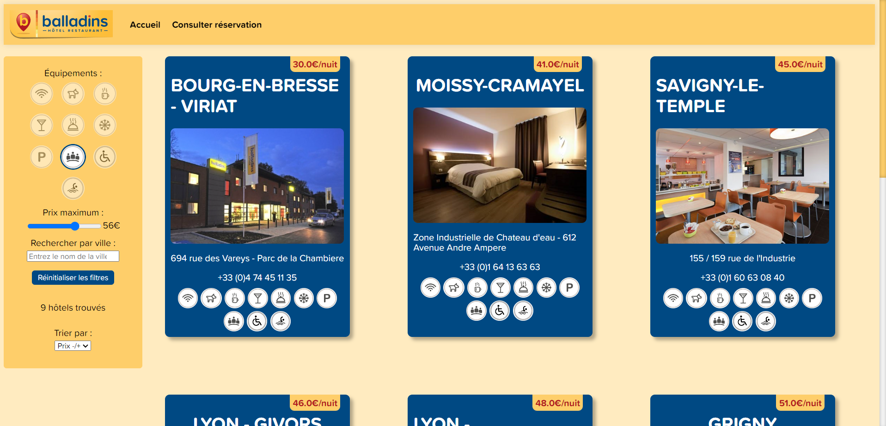
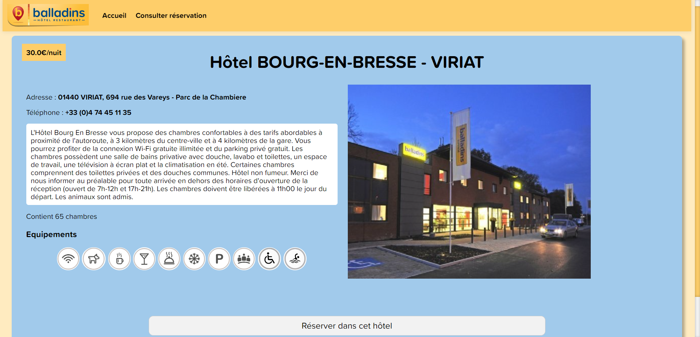
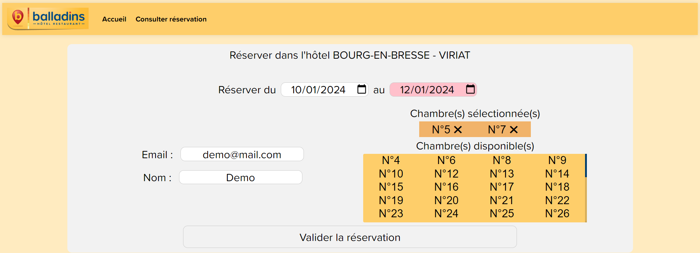
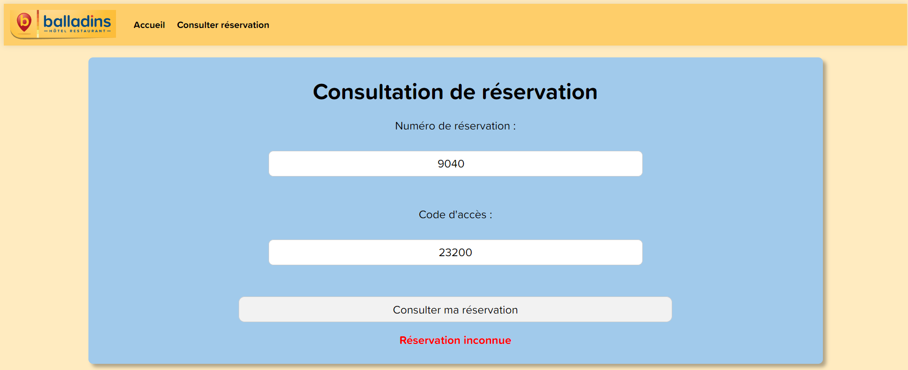
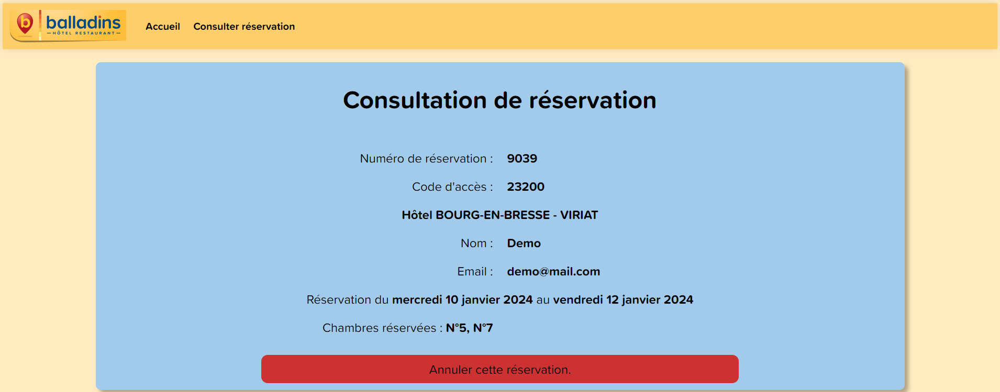
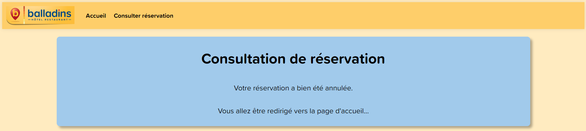

# Informations du projet

Ce projet **Web** a été réalisé en **PHP** avec un **modèle MVC personnalisé** associé à une base de données SQL Server.

# Objectif de l'application

L'application Web a pour but de manipuler et de visionner les informations d'une base de données concernant des hôtels.

## Fonctionnalités

L'application permet de :
- Visualiser une liste d'hôtel.
- Voir les informations d'un hôtel sélectionné.
- Réserver des chambres dans un hôtel choisi à une période choisie.
- Consulter une réservation via son numéro et son code d'accès.
- Supprimer une réservation

## Schéma relationnel de la base de données exploitée

## Visuels des pages de l'application web

### Page d'accueil :

### Page de visualisation des informations d'un hôtel :

### Page de formulaire de création de réservation :

### Page de formulaire pour consulter une réservation :

### Page de visualisation des informations d'une réservation :

### Page de redirection avec confirmation de l'annulation :

# Installation

## Comment joindre la base de données du projet ?

*Explication pour Microsoft SQL Server Management Studio*
--> Récupérez les fichiers .mdf et .ldf de la base de données.
Dans MSSMS, faites *clic-droit* sur "**Bases de données**" -> "**Joindre**" -> "**Ajouter**" -> *sélectionnez le fichier .mdf*-> Enfin, cliquez sur "**Ok**".

## Comment lier une base de données au projet ?

Dans le dossier "model" du projet, ouvrir le fichier "**DBModel.php**".
--> Cherchez les variables suivantes et complétez les avec vos propres valeurs :

	$server = "<nom_du_serveur_sql_server>";
	$dbname = "<nom_de_la_bdd>";
	$user = "<identifiant_de_connexion_a_la_bdd>";
	$password = "<mot_de_passe_de_connexion_a_la_bdd>";
