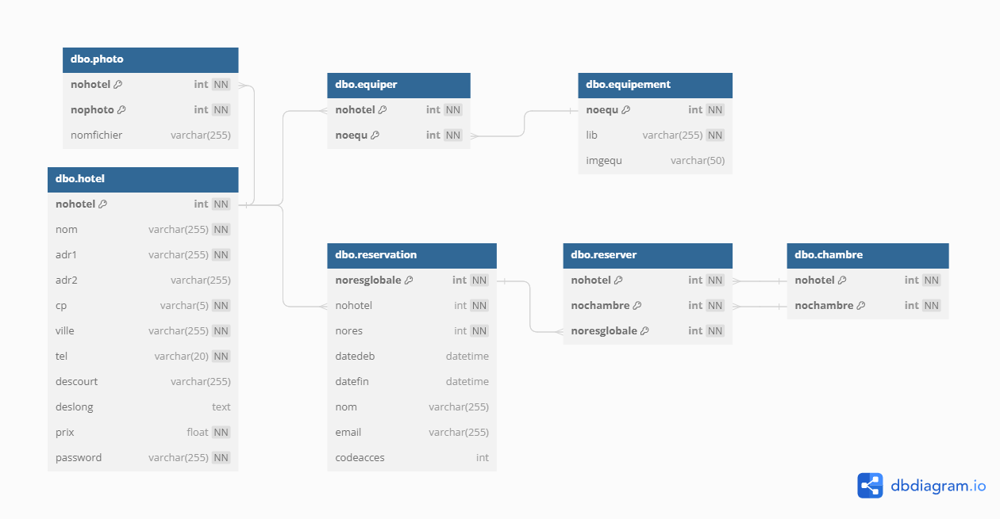

# Informations du projet

Ce projet **Web** a été réalisé en **PHP** avec un **modèle MVC personnalisé** associé à une base de données SQL Server.

# Objectif de l'application

L'application Web a pour but de manipuler et de visionner les informations d'une base de données concernant des hôtels.

## Fonctionnalités

L'application permet de :
- Visualiser une liste d'hôtel.
- Voir les informations d'un hôtel sélectionné.
- Réserver des chambres dans un hôtel choisi à une période choisie.
- Consulter une réservation via son numéro et son code d'accès.
- Supprimer une réservation

## Schéma relationnel de la base de données exploitée

## Visuels de l'interface de l'application

### Interface d'accueil :

### Interface de gestion des informations hôtel :

### Interface de gestion des chambres :

### Interface de visualisation et d'édition des réservations :

### Interface de création de réservation :

# Installation

## Comment joindre la base de données du projet ?

*Explication pour Microsoft SQL Server Management Studio*
--> Récupérez les fichiers .mdf et .ldf de la base de données.
Dans MSSMS, faites *clic-droit* sur "**Bases de données**" -> "**Joindre**" -> "**Ajouter**" -> *sélectionnez le fichier .mdf*-> Enfin, cliquez sur "**Ok**".

## Comment lier une base de données au projet ?

Dans le dossier du projet, ouvrir le fichier "**App.config**".
--> Cherchez la balise suivante :

    <connectionStrings>
	    ...
    </connectionStrings>

 --> Dans cette balise, modifier le nom du serveur et de l'instance suivant le paramètre "***data source=***" par votre propre serveur et instance

    <add name="connexiondb" 
	    ...
	    data source=VGTOM\SQLSERVEREXPRESS;
	    ...
    />

Si vous lancez directement le .exe situé dans  "`bin/Debug/`", réalisez la même opération mais dans le fichier  "**AP-HOTEL-APPLI.exe.config**".
